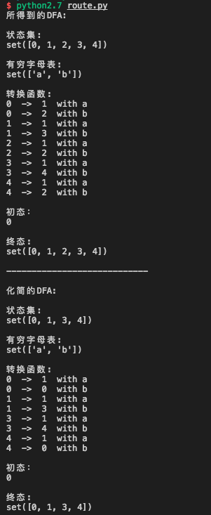

# Python 实现 NFA->DFA->sim_DFA的转换

目录结构如下

```
├── controller #数据的组装，逻辑的调用
│   ├── automataController.py
├── model # 三种有穷自动机向上抽象的共有五元组，实现了一些带有语义的方法
│   ├── Model.py
├── readme.md
├── route.py # 入口文件，把接口暴露出来，只负责调用controller
└── service #具体的逻辑实现
    ├── DFAService.py #实现dfa->sim_DFA
    ├── NFAService.py #实现nfa->dfa
```

此系统使用Python2.7

启动方法

```
python2.7 route.py
```

程序截图

